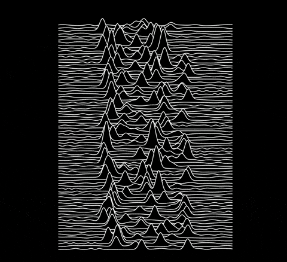
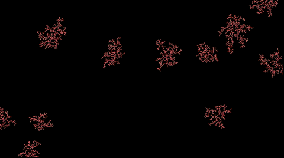
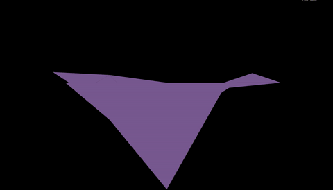
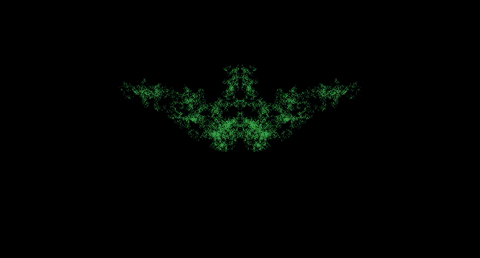

# XScreenSaver.js
The beginning of a series of XScreenSaver hacks implemented in Javascript.

### Unknown Pleasures

[Live preview](http://negaex.com/app/XScreenSaver.js/UnknownPleasures.html)

[PSR B1919+21](https://en.wikipedia.org/wiki/PSR_B1919%2B21) (AKA CP 1919) was the first [pulsar](https://en.wikipedia.org/wiki/Pulsar) ever discovered: a spinning neutron star emitting a periodic lighthouse-like beacon. An illustration of the signal received from it was published in Scientific American in 1971, and later in The Cambridge Encyclopedia of Astronomy in 1977, where it was seen by Stephen Morris, the drummer of [Joy Division](https://en.wikipedia.org/wiki/Joy_Division), and was consequently appropriated by [Peter Saville](https://en.wikipedia.org/wiki/Peter_Saville_%28graphic_designer%29) for the cover of the band's album [Unknown Pleasures](https://en.wikipedia.org/wiki/Unknown_Pleasures).

Original author: Jamie Zawinski; 2013.

### Coral

[Live preview](http://negaex.com/app/XScreenSaver.js/Coral.html)

Simulates coral growth.

Original author: Frederick Roeber; 1997.

### Triangle

[Live preview](http://negaex.com/app/XScreenSaver.js/Triangle.html)

Generates random mountain ranges using iterative subdivision of triangles.

Original author: Tobias Gloth; 1997.

(Note: The slow framerate in the gif is due to the screen-capturing program)

### Rorschach

[Live preview](http://negaex.com/app/XScreenSaver.js/Rorschach.html)

[Inkblot patterns](https://en.wikipedia.org/wiki/Rorschach_test) via a reflected [random walk](https://en.wikipedia.org/wiki/Random_walk).

Original author: Jamie Zawinski; 1992.

